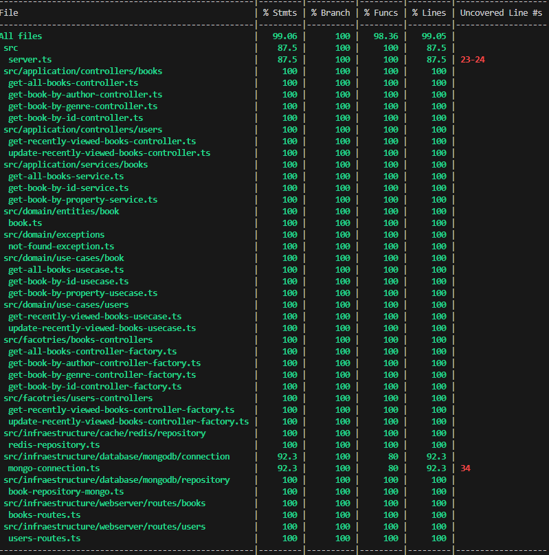
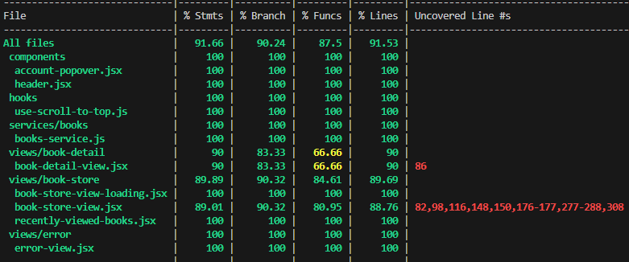

# 📘 Code elevate - Igor dos santos cabral

## I. Arquitetura de Solução e Arquitetura Técnica

### 🧩 Descrição da Solução

Plataforma desenvolvida contendo solução **back-end** e **front-end**, projetada para atender uma livraria independente que deseja disponibilizar seu acervo digitalmente. A API permite:

1.  buscar todos os livros presentes no acervo
2.  busca livros por gênero
3.  busca livros por autor
4.  Visualização dos livros recentes visualizados

Tudo isso performance otimizada por cache e estrutura preparada para escalabilidade.

### 🚀 Como rodar o projeto

1. Tenha [Docker](https://www.docker.com/) e [Docker Compose](https://docs.docker.com/compose/) instalados na sua máquina.
2. Clone esse repositório `git clone git@github.com:IgorCantos/code-elevate.git`
3. Na pasta **raiz** rode o comando `docker-compose up -d`
   3.1. Os containeres `mongodb`, `redis`, `book-store-backend` e `book-store-frontend` serão buildados e inicializados
4. O front-end pode se acessado através do link [http://localhost:3030/](http://localhost:3030/)
5. O back-end pode se acessado através do link [http://localhost:8080/v1/books](http://localhost:8080/v1/books/)

### ✅ Testes unitários

<table>
  <tr>
    <th>Testes unitários back-end</th>
    <th>Testes unitários front-end</th>
  </tr>
  <tr>
    <td></td>
    <td></td>
  </tr>
</table>

### 🛠️ Tecnologias Utilizadas

#### Back-end

- **Linguagem:** [Typescript](https://www.typescriptlang.org/)
- **Framework:** [Fastify 5](https://fastify.dev/)
- **Banco de Dados:** [MongoDB](https://www.mongodb.com/)
- **Cache:** [Redis](https://redis.io/)
- **Documentação da API:** [Swagger](https://swagger.io/)(OpenApi 3.0)
- **Build Tool:** [Typescript Compiler](https://www.typescriptlang.org/docs/handbook/compiler-options.html)
- **Containerização:** [Docker](https://www.docker.com/) e [Docker Compose](https://docs.docker.com/compose/)
- **Testes Unitários:** [Jest](https://jestjs.io/pt-BR/)
- **Controle de Versão:** Git + GitHub

#### Front-end

- **Linguagem:** [Javascript](https://developer.mozilla.org/pt-BR/docs/Web/JavaScript)
- **Framework:** [React](https://react.dev/)
- **Documentação da API:** [Swagger](https://swagger.io/) (OpenApi 3.0)
- **Build Tool:** [Vite](https://vite.dev/)
- **Containerização:** [Docker](https://www.docker.com/) e [Docker Compose](https://docs.docker.com/compose/)
- **Testes Unitários:** [Jest](https://jestjs.io/pt-BR/)
- **Controle de Versão:** Git + GitHub

### 🧱 Decisões de Design

#### **🧼 Clean Architecture aplicada no Back-end**

- O back-end foi estruturado usando **Clean Architecture**, com foco em baixo acoplamento, testabilidade e separação de responsabilidades. As regras de negócio são isoladas e dependem apenas de interfaces — o que torna o sistema resiliente à troca de tecnologias como banco de dados ou cache.

Essa **inversão de dependência** permitiu:

- Facilidade na substituição de tecnologias (ex: MongoDB → PostgreSQL)
- Separação de responsabilidades
- Testes unitários simples com mocks
- Evolução e manutenção mais seguras

**⚠️ IMPORTANTE : A estrutura foi organizada nas seguintes camadas:⚠️**

- `infrastructure/`: implementa todos os detalhes técnicos de frameworks e dependências que a aplicação usa, como acesso a banco de dados, cache, etc.
- `infrastructure/webserver/routes` expõe os endpoints REST e lida com requisições HTTP.
- `factories/` responsável pela injeção de dependências do projeto. É um intermediário entre a `/routes` e a camada de `/controllers`, que já são criados com todas as dependências (serviços, repositórios e casos de uso) necessárias para seu funcionamento. **Todos os controllers e suas dependências são altamente dependentes de interfaces** e não implementam lógicas concretas.
- `application/`: responsável pela orquestração das requisições HTTP a nível dos controllers e orquestração dos serviços
- `domain/`: contém as entidades e casos de uso da aplicação (que dependem de interfaces), contendo suas regras de negócio puras e interfaces de domínio.

#### ⚠️ IMPORTANTE: Banco de dados já populado ⚠️

Ao iniciar o projeto com Docker pela primeira vez, o container do MongoDB já será populado com **livros reais**. Isso garante que a API funcione imediatamente com dados reais — veja mais na próxima seção.

---

## II. Explicação sobre o Case Desenvolvido (Plano de Implementação)

### 🔄 Aquisição e Geração de Dados

Testei várias fontes de dados, mas nenhum me deu o resultado que gostaria, até encontrar uma solução com o Google Books.

- **✅ Google Books**: após algumas interações com a [API](https://www.googleapis.com/books/v1/volumes) descobri que não precisava de uma ApiKey e que ela não tinha um rate limiting para a quantidade de dados que eu precisava buscar. Também oferecia o link da imagem da capa do livro já hospedado no Google. Era tudo o que eu precisava. Criei um script (localizado na pasta /scripts na raiz aqui do projeto) que faz um loop na API buscando vários livros separados por gêneros pré-definidos por mim. Funcionou muito bem, consegui um dataset muito bom que usei no projeto. **O ponto negativo é que o Google Books só possui dados em inglês.**

- **❌ Kaggle:** muitos datasets com dados incompletos ou imagens quebradas
- **❌ Amazon:** API com acesso restrito e limitada para grandes volumes
- **❌ IA:** não era viável devido à ausência de imagens hospedadas

### 🧠 Entidade Livro (Modelo de Dados)

```javascript
Book {
"_id":  "681f9fab48212582f0d861e2",
"title":  "Mysteries",
"author":  "Knut Hamsun",
"publishedDate":  "2001-01-01",
"description":  "The first complete English translation of the Nobel Prize-winner’s literary masterpiece A Penguin Classic Mysteries is the story of Johan Nilsen Nagel, a mysterious stranger who suddenly turns up in a small Norwegian town one summer—and just as suddenly disappears. Nagel is a complete outsider, a sort of modern Christ treated in a spirit of near parody. He condemns the politics and thought of the age, brings comfort to the “insulted and injured,” and gains the love of two women suggestive of the biblical Mary and Martha. But there is a sinister side of him: in his vest he carries a vial of prussic acid... The novel creates a powerful sense of Nagel's stream of thought, as he increasingly withdraws into the torture chamber of his own subconscious psyche. For more than seventy years, Penguin has been the leading publisher of classic literature in the English-speaking world. With more than 1,800 titles, Penguin Classics represents a global bookshelf of the best works throughout history and across genres and disciplines. Readers trust the series to provide authoritative texts enhanced by introductions and notes by distinguished scholars and contemporary authors, as well as up-to-date translations by award-winning translators.",
"genre":  "Fiction",
"categorie":  "Fiction",
"thumbnail":  "http://books.google.com/books/content?id=MRoMUV2kLZEC&printsec=frontcover&img=1&zoom=1&source=gbs_api",
"pageCount":  356,
"averageRating":  4,
"amount":  49.99,
"currencyCode":  "BRL"
}
```

### 📦 APIs Implementadas

#### Swagger disponível na pasta /docs.

| Endpoint                                 | Descrição                                                                                        |
| ---------------------------------------- | ------------------------------------------------------------------------------------------------ |
| `GET /health`                            | Health check da aplicação                                                                        |
| `GET /v1/books`                          | Retorna todos os livros (com paginação)                                                          |
| `GET /v1/books/:bookId`                  | Busca livro por ID (com paginação)                                                               |
| `GET /v1/books/genre/:genre}`            | Busca livros por gênero (com paginação)                                                          |
| `GET /v1/books/author/:author`           | Busca livros por autor (com paginação)                                                           |
| `GET /v1/users/:userId/recently-viewed`  | Retorna os 10 últimos livros visualizados pelo usuário                                           |
| `POST /v1/users/:userId/recently-viewed` | Insere no redis (com base no userId) o livro acessado pelo usuário enviado no body da requisição |

### 🗄️ Banco de dados NOSQL MongoDB

Escolhi usar o MongoDB como banco de dados pela flexibilidade no schema e também pela performance que ele possui quando se tem consultas simples, que é o caso dos endpoints desse case.

Porém, em um ambiente produtivo que demanda escala não iria por esse caminho apenas. Possivelmente usaria também o **Elastic Seach** que teria dados replicados do MongoDB, assim não sobrecarregaria o banco e conseguiria lidar melhor com grandes volumes de dados (10M+ de livros, por exemplo), além de permitir consultas mais complexas.

### 🖥️ Front-end

Optei por também criar um front-end para o case, para ter algo mais visual do que foi feito no back-end. E, se tivesse tempo, conseguiria adicionar uma página de login com autenticação (não deu tempo).

---

## II. Melhorias e Considerações Finais

### Melhorias

1. Implementação do ElasticSearch para buscas otimizadas
2. Testes de integração e End to End com [Cypress](https://www.cypress.io/)
3. Autenticação ([Firebase](https://firebase.google.com/docs/auth?hl=pt-br) - grátis para projetos desse escopo)
4. Carrinho de compras - Integração com [Stripe](https://stripe.com/br)
5. Favoritar livros/autores

### Considerações finais

Um dos pontos mais interessantes do projeto foi buscar uma base de dados que realmente se encaixasse no caso de uso. Como a proposta incluía uma interface visual, era importante que o dataset trouxesse também as capas dos livros — o que exigiu um pouco mais de pesquisa e refinamento. No fim, a escolha valeu a pena e contribuiu bastante para a experiência final da aplicação.

De modo geral, tentei focar em entregar algo bem estruturado, funcional e com atenção aos detalhes, equilibrando boas práticas técnicas com uma apresentação bem feita.
